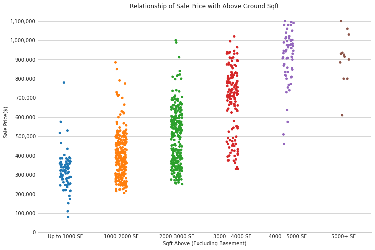
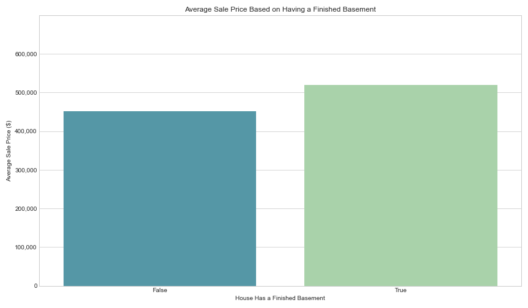
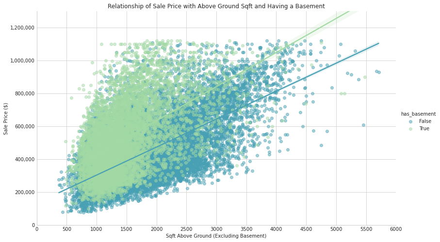
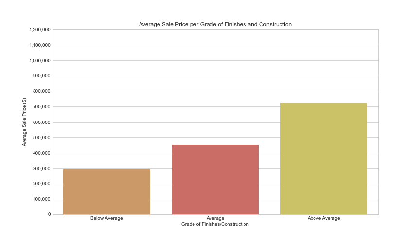
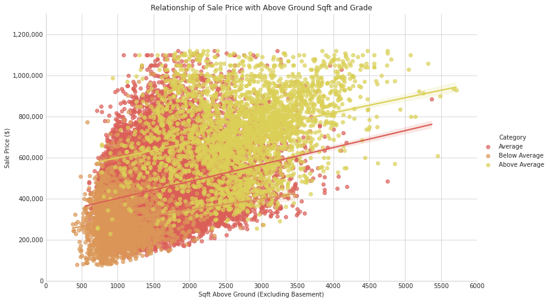
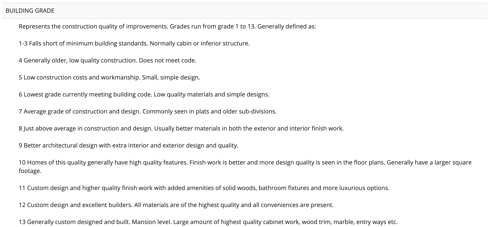

# King County Renovation: Most Effective Ways to Increase the Value of Your Home
## Building a Multiple Linear Regression model for the real estate data in King County to maximize sale price of homes based on 3 parameters.
&nbsp;

**Author:** E. Berke Tezcan

***


## Introduction

For this project, we were hired by a homeowner in King County, Washington who wants to renovate their home. They would like us to analyze the real estate data of the county and give them insights as to what to focus their renovation efforts on in order to increase their property's value. 

Real estate prices are affected by a myriad of -- what we can define as -- internal parameters like the square footage, floor count, bedroom count, finishes, how many cars can fit into the garage, etc. There are also parameters that we can define as external and can not (easily) be changed. These include attributes like zipcode, latitude, longitude, view from the house, and school districts. In order to accurately model and pinpoint the most important parameters that affect the sale price of a home, we need to incorporate both internal and external parameters into our model.

## Data

We were given a dataset that includes information about the real estate in King County and will be using this dataset to create a multiple linear regression (MLR) model. We defined our goal to be to find the top 3 internal parameters that affect a home's sale price the most in King County specifically. This will ensure that the homeowner can actually keep these parameters in mind while renovating rather than getting insights about external parameters that they can't necessarily do anything to change.


## Methods

We initally started off with exploratory data analysis (EDA) to understand the columns and the dataset overall. We then proceeded with checking for the linearity assumption that MLR models require. This allowed us to find categorical columns to one hot encode. We then proceeded to check for multicollinearity between different columns and engineered features to keep the data points in the model without losing too many potentially significant information. Then, we removed outliers with the IQR method from our target column 'price.' From here it was an iterative process of removing statistically insignificant (our alpha level was 0.05) parameters and checking the residuals for normality and homoscedasticity.

## Results

After many iterations on our model, we ended up having the results described below.

### The Relationship of Sale Price with Above Ground Square Footage
&nbsp;


> As can be seen above, as the square footage of the house increased, sale price of the home also tended to increase with it. Even though there is a spread of price at each category of square footage and therefore some overlaps between them, there is a clear positive trend between sale price and square footage above ground. Additionally, it should be noted that, as the square footage increases, the minimum sale price of the category is consistently increasing as well indicating that, even if the house may not be optimal per other parameters, having a certain amount of square footage tends to make it more valuable.

&nbsp;

### Average Sale Price Based on Having a Finished Basement



> Exploring the relationship between having a finished basement and the sale price, we see that homes that had finished basements had a higher average sale price of approximately $520,000 compared to homes that did not at approximately $451,000. 

&nbsp;
### The Relationship of Sale Price with Above Ground Square Footage and Having a Basement
&nbsp;


> When we look at the relationship between square footage above ground and the home's sale price again, but add in the paremeter that shows whether a house had a finished basement or not, the houses with a finished basement have a slightly more positive relationship with the sale price. So if a house had a basement, it tended to have a slightly higher price than a similar sized (based on above ground sqft) home without a basement. This is visible from the difference of slopes between the two lines shown above where the green line is diverging from the blue line in a positive way.

&nbsp;
### Average Sale Price per Grade of Finishes and Construction
&nbsp;



>Another interesting, but also expected relationship, is between the grade of finishes and the sale price. Houses that had higher grades of finishes and a better construction quality sold for higher prices.

&nbsp;
### The Relationship of Sale Price with Above Ground Square Footage and Grade of Finishes/Quality of Construction
&nbsp;


>When grade is plotted with square footage above ground, the relationship shown in the previous visual becomes even more apparent. As can be seen from the different colored data points, above average homes tended to have a higher sale price compared to their counterparts. The regression lines for average and above average homes have a higher positive slope compared to the below average homes, which means that, as the square footage of a home increases, the higher graded homes will tend to have higher prices. 

&nbsp;

Even though renovations are usually a lot of effort and stressful to many homeowners, they may help increase the property's value. To sum up, our analysis for King County, Washington showed the following:

- Increasing the square footage above ground tends to increase the house's value.
- Focusing on the grade of finishes and the quality of construction as a whole tends to pay dividends when it comes to selling the house.
- Having a basement is the third most effective parameter in increasing a home's sale price. 


## Recommendations

Our first recommendation based on our findings above would be for the homeowner to renovate their house and add livable above ground square footage to the property. This could be in the shape of an added extension to the home or a simpler approach of finishing the attic space.

Secondly, we would advise the homeowner to also focus their renovation efforts on the finishes and quality of the materials that they would be choosing to use. This could include components such as kitchen countertop material, cabinetry design, bathroom fixtures, general lighting design and fixture choices inside and outside the house, and flooring. For more inspiration, they could refer to the below legend for the different grade values that the data included. (Below Average: 1-6, Average: 7-8, Above Average: 9-13)
&nbsp;


&nbsp;

Lastly, we would propose that the homeowner add a basement to their home. It should be noted that since we do not know what the construction costs of this undertaking would be like versus the gain in the home's sale price, it is difficult to predict the outcome (refer to the Limitations & Next Steps section for more information on this). However, based on our model, we found that having a basement for homes was the third most effective parameter. If the home already has a basement, but the basement is unfinished, our recommendation would be for the homeowner to make the basement an occupiable space by finishing it. 
&nbsp;

## Limitations & Next Steps

Given more time and information about what the homeowner's renovation budget would be, we would have wanted to analyze whether these top 3 parameters would truly be the most effective in bringing a net value increase since a renovation such as adding a basement to a home would be very costly and may not end up returning a net value increase. Additionally, the construction costs in the state of Washington may be higher than other states due to factors such as permitting, material costs, logistical challenges, etc., which may effect the net value increase of any renovations as well. Furthermore, having information about whether the homeowner is thinking about living in the renovated house or renting it out would allow us to fine tune our analysis and bring more valuable insight. Lastly, our model was based specifically off of data on King County, Washington which means it is only accurate for this region. We would like to extend the abilities of our model by analyzing further data from different states and counties.

&nbsp;
## For More Information

Please review my full analysis in [my Jupyter Notebook](./final_notebook.ipynb) or my [presentation](./presentation.pdf). For any additional questions, please contact Berke Tezcan at berketezcan@gmail.com.


&nbsp;
### Repository Structure


```

├── README.md               <- The top-level README for reviewers of this project.
├── final_notebook.ipynb    <- Narrative documentation of analysis in jupyter notebook
├── notebook.pdf            <- Narrative documentation of analysis in PDF
├── presentation.pdf        <- PDF version of project presentation
├── images                  <- Both sourced externally and generated from code
└── data                    <- Externally sourced data

```
## Appendix A: Effect of Zipcode on Home Sale Price

One of the parameters that we found that had a significant impact on a home's sale price was the zipcode of the address where the home is located. Below zipcodes are the top 5 that had the most positive effect on a home's sale price. Since the zipcode of a house is not a parameter that can be changed by a renovation, we are only providing this information for reference.
&nbsp;

| Position by Effect Size       | Zipcode           | Primary City  |
| ------------- |:-------------:| -----:|
| 1      | 98039 | Medina |
| 2      | 98004      |   Bellevue |
| 3 | 98040      |    Mercer Island |
| 4 | 98112      |   Seattle |
| 5 | 98109      |    Seattle |
